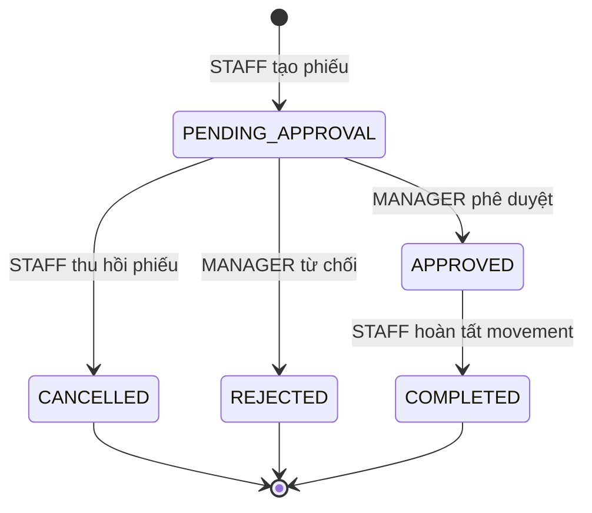
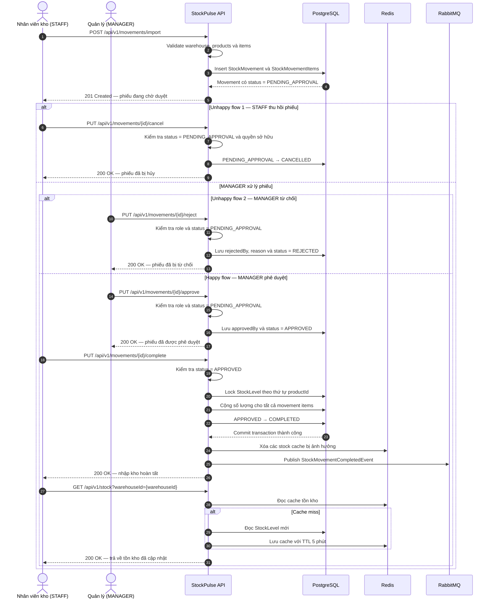
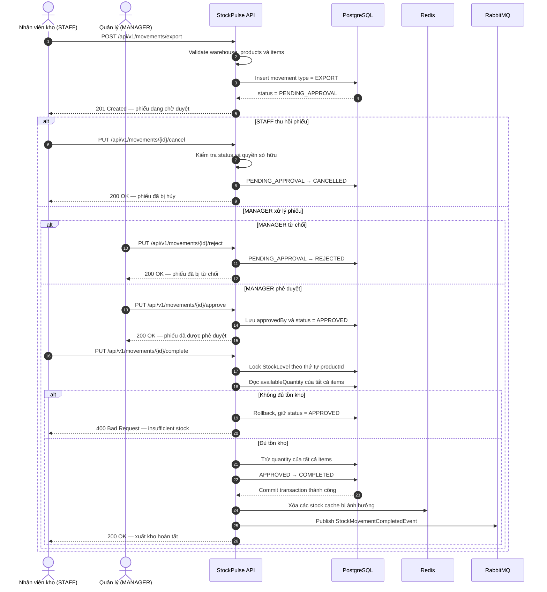
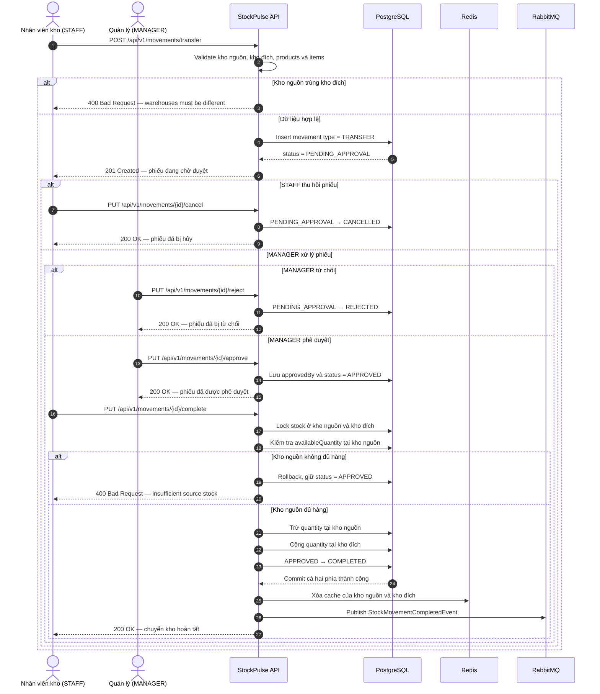

# Week 2 — Quy trình nghiệp vụ nhập, xuất và chuyển kho

## 1. Mục đích

Tài liệu này mô tả vòng đời của ba loại `StockMovement`:

- `IMPORT`: nhập hàng vào một kho.
- `EXPORT`: xuất hàng ra khỏi một kho.
- `TRANSFER`: chuyển hàng từ kho nguồn sang kho đích.

Tài liệu bao gồm:

- Happy flow: tạo phiếu, phê duyệt và hoàn tất movement.
- Unhappy flow: nhân viên hủy phiếu hoặc quản lý từ chối phiếu.
- Endpoint API và role được phép thực hiện từng hành động.
- Điều kiện chuyển trạng thái và ảnh hưởng đến tồn kho.

> **Lưu ý về phạm vi:** specification Week 2 đã định nghĩa API tạo, phê duyệt và
> hoàn tất movement. Các API `reject` và `cancel` trong tài liệu này là đề xuất
> bổ sung để có thể triển khai đầy đủ state flow `PENDING_APPROVAL`, `REJECTED`
> và `CANCELLED`.

## 2. Actor và trách nhiệm

| Actor | Role | Trách nhiệm |
|---|---|---|
| Nhân viên kho | `STAFF` | Tạo phiếu nhập/xuất/chuyển, thu hồi phiếu và xác nhận movement đã thực sự hoàn tất |
| Quản lý | `MANAGER` | Kiểm tra nội dung phiếu, phê duyệt hoặc từ chối |
| StockPulse API | Hệ thống | Kiểm tra quyền, validation, quản lý trạng thái và cập nhật tồn kho trong transaction |
| RabbitMQ consumers | Hệ thống nội bộ | Xử lý các tác vụ sau khi movement hoàn tất như kiểm tra mức tồn và phát cảnh báo |

## 3. Vòng đời trạng thái



Các trạng thái kết thúc:

- `COMPLETED`: phiếu hoàn tất và tồn kho đã được cập nhật.
- `REJECTED`: phiếu bị quản lý từ chối, tồn kho không thay đổi.
- `CANCELLED`: phiếu bị nhân viên hủy, tồn kho không thay đổi.

## 4. Danh sách endpoint và role

| Thứ tự | Nghiệp vụ | Endpoint | Role trigger | Chuyển trạng thái | Trong Week 2 |
|---:|---|---|---|---|---|
| 1a | Tạo phiếu nhập | `POST /api/v1/movements/import` | `STAFF` | `NEW → PENDING_APPROVAL` | Có |
| 1b | Tạo phiếu xuất | `POST /api/v1/movements/export` | `STAFF` | `NEW → PENDING_APPROVAL` | Có |
| 1c | Tạo phiếu chuyển kho | `POST /api/v1/movements/transfer` | `STAFF` | `NEW → PENDING_APPROVAL` | Có |
| 2 | Xem chi tiết phiếu | `GET /api/v1/movements/{id}` | `STAFF` | Không đổi | Có |
| 3 | Thu hồi phiếu đang chờ duyệt | `PUT /api/v1/movements/{id}/cancel` | `STAFF` tạo phiếu | `PENDING_APPROVAL → CANCELLED` | Đề xuất bổ sung |
| 4a | Phê duyệt phiếu | `PUT /api/v1/movements/{id}/approve` | `MANAGER` | `PENDING_APPROVAL → APPROVED` | Có |
| 4b | Từ chối phiếu | `PUT /api/v1/movements/{id}/reject` | `MANAGER` | `PENDING_APPROVAL → REJECTED` | Đề xuất bổ sung |
| 5 | Hoàn tất movement | `PUT /api/v1/movements/{id}/complete` | `STAFF` | `APPROVED → COMPLETED` | Có |
| 6 | Kiểm tra tồn kho | `GET /api/v1/stock` | `STAFF` | Không đổi | Có |

## 5. Sequence diagram — happy và unhappy flow

### 5.1. Flow nhập kho — IMPORT



### 5.2. Flow xuất kho — EXPORT



### 5.3. Flow chuyển kho — TRANSFER



## 6. Chi tiết API

### 6.1. Tạo phiếu nhập

```http
POST /api/v1/movements/import
Authorization: Bearer <staff-token>
Content-Type: application/json
```

Role:

```text
STAFF
```

Request minh họa:

```json
{
  "warehouseId": 1,
  "notes": "Nhập hàng từ nhà cung cấp ABC",
  "items": [
    {
      "productId": 101,
      "quantity": 50,
      "unitCost": 250000
    },
    {
      "productId": 102,
      "quantity": 30,
      "unitCost": 150000
    }
  ]
}
```

Kết quả nghiệp vụ:

- Tạo `StockMovement` có `type = IMPORT`.
- Tạo các `StockMovementItem`.
- `createdBy` là ID của `STAFF` lấy từ JWT.
- `approvedBy = NULL`.
- Trạng thái ban đầu là `PENDING_APPROVAL`.
- Chưa cập nhật `StockLevel`.

### 6.2. Tạo phiếu xuất

```http
POST /api/v1/movements/export
Authorization: Bearer <staff-token>
Content-Type: application/json
```

Role:

```text
STAFF
```

Request minh họa:

```json
{
  "warehouseId": 1,
  "notes": "Xuất hàng cho đơn giao nội bộ",
  "items": [
    {
      "productId": 101,
      "quantity": 20
    },
    {
      "productId": 102,
      "quantity": 10
    }
  ]
}
```

Kết quả nghiệp vụ:

- Tạo `StockMovement` có `type = EXPORT`.
- Trạng thái ban đầu là `PENDING_APPROVAL`.
- `createdBy` là ID của `STAFF`; `approvedBy = NULL`.
- Chưa trừ `StockLevel` khi tạo hoặc phê duyệt phiếu.
- Việc kiểm tra và trừ tồn chính thức diễn ra khi gọi `complete`.

Hệ thống có thể kiểm tra tồn sơ bộ khi tạo phiếu để phản hồi sớm, nhưng bắt
buộc phải kiểm tra lại dưới pessimistic lock khi complete vì tồn kho có thể đã
thay đổi trong thời gian chờ phê duyệt.

### 6.3. Tạo phiếu chuyển kho

```http
POST /api/v1/movements/transfer
Authorization: Bearer <staff-token>
Content-Type: application/json
```

Role:

```text
STAFF
```

Request minh họa:

```json
{
  "warehouseId": 1,
  "destWarehouseId": 2,
  "notes": "Điều chuyển hàng từ Hà Nội vào Đà Nẵng",
  "items": [
    {
      "productId": 101,
      "quantity": 15
    },
    {
      "productId": 102,
      "quantity": 5
    }
  ]
}
```

Điều kiện:

- Kho nguồn `warehouseId` tồn tại và đang hoạt động.
- Kho đích `destWarehouseId` tồn tại và đang hoạt động.
- Kho nguồn và kho đích không được giống nhau.
- Phiếu có ít nhất một item và mỗi `quantity > 0`.
- Các product tồn tại và đang hoạt động.

Kết quả nghiệp vụ:

- Tạo `StockMovement` có `type = TRANSFER`.
- `warehouseId` là kho nguồn.
- `destWarehouseId` là kho đích.
- Trạng thái ban đầu là `PENDING_APPROVAL`.
- Chưa thay đổi tồn kho ở cả kho nguồn và kho đích.

### 6.4. Thu hồi phiếu

> API đề xuất bổ sung.

```http
PUT /api/v1/movements/{id}/cancel
Authorization: Bearer <staff-token>
Content-Type: application/json
```

Role:

```text
STAFF
```

Request minh họa:

```json
{
  "reason": "Nhà cung cấp giao sai số lượng"
}
```

Các transition được phép:

```text
PENDING_APPROVAL → CANCELLED
```

Các transition không được phép:

```text
APPROVED → CANCELLED
COMPLETED → CANCELLED
REJECTED → CANCELLED
CANCELLED → CANCELLED
```

Khuyến nghị chỉ cho phép `STAFF` đã tạo phiếu được hủy:

```text
currentUserId == movement.createdBy
```

Việc hủy phiếu không làm thay đổi tồn kho.

### 6.5. Quản lý phê duyệt

```http
PUT /api/v1/movements/{id}/approve
Authorization: Bearer <manager-token>
```

Role:

```text
MANAGER
```

Điều kiện:

- Movement tồn tại.
- Trạng thái hiện tại là `PENDING_APPROVAL`.
- Người gọi có role `MANAGER`.

Kết quả:

```text
PENDING_APPROVAL → APPROVED
approvedBy = ID của MANAGER lấy từ JWT
```

Tồn kho chưa thay đổi tại bước phê duyệt.

Theo phạm vi specification hiện tại, bất kỳ user có role `MANAGER` đều có thể
duyệt movement. Chưa có quy tắc giới hạn manager theo warehouse.

### 6.6. Quản lý từ chối

> API đề xuất bổ sung.

```http
PUT /api/v1/movements/{id}/reject
Authorization: Bearer <manager-token>
Content-Type: application/json
```

Role:

```text
MANAGER
```

Request minh họa:

```json
{
  "reason": "Đơn giá không khớp với chứng từ nhà cung cấp"
}
```

Điều kiện:

- Movement tồn tại.
- Trạng thái hiện tại là `PENDING_APPROVAL`.
- Người gọi có role `MANAGER`.
- Lý do từ chối không được để trống.

Kết quả:

```text
PENDING_APPROVAL → REJECTED
```

Việc từ chối phiếu không làm thay đổi tồn kho. `approvedBy` tiếp tục là `NULL`;
không sử dụng `approvedBy` để lưu người từ chối.

Trong phạm vi đơn giản của Week 2, `REJECTED` nên là trạng thái kết thúc. Nếu
nhân viên muốn sửa nội dung thì tạo một movement mới.

### 6.7. Hoàn tất nhập kho

```http
PUT /api/v1/movements/{id}/complete
Authorization: Bearer <staff-token>
```

Role:

```text
STAFF
```

Điều kiện:

- Movement tồn tại.
- Movement có `type = IMPORT`.
- Trạng thái hiện tại là `APPROVED`.
- Phiếu chưa từng được complete.
- Warehouse và các product vẫn hợp lệ.
- Mỗi movement item có `quantity > 0`.

Xử lý trong cùng một transaction:

1. Đọc movement và toàn bộ movement items.
2. Sắp xếp item theo `productId`.
3. Lock các `StockLevel` liên quan theo thứ tự `productId`.
4. Nếu đã có `StockLevel`, cộng thêm quantity.
5. Nếu chưa có `StockLevel`, tạo mới với `reservedQuantity = 0`.
6. Chuyển trạng thái movement từ `APPROVED` sang `COMPLETED`.
7. Commit toàn bộ thay đổi.

Sau khi commit:

1. Xóa Redis cache của các cặp warehouse-product bị ảnh hưởng.
2. Publish `StockMovementCompletedEvent` lên RabbitMQ.
3. Consumer kiểm tra mức tồn và xử lý các tác vụ cảnh báo liên quan.

### 6.8. Hoàn tất xuất kho

```http
PUT /api/v1/movements/{id}/complete
Authorization: Bearer <staff-token>
```

Role:

```text
STAFF
```

Điều kiện:

- Movement tồn tại và có `type = EXPORT`.
- Trạng thái hiện tại là `APPROVED`.
- Phiếu chưa từng được complete.
- Mỗi product phải có `StockLevel` tại kho xuất.
- Tồn khả dụng của từng product phải đủ:

```text
availableQuantity = quantity - reservedQuantity
availableQuantity >= movementItem.quantity
```

Xử lý trong cùng một transaction:

1. Đọc movement và sắp xếp items theo `productId`.
2. Pessimistic lock tất cả `StockLevel` tại kho xuất theo thứ tự `productId`.
3. Kiểm tra tồn khả dụng của **toàn bộ** items trước khi trừ.
4. Nếu một item không đủ tồn, rollback toàn bộ và giữ status `APPROVED`.
5. Nếu tất cả đều đủ, trừ quantity của từng `StockLevel`.
6. Chuyển movement từ `APPROVED` sang `COMPLETED`.
7. Commit toàn bộ thay đổi.

Ví dụ:

```text
Tồn hiện tại = 100
Reserved     = 20
Available    = 80
Số lượng xuất = 30
Tồn sau xuất  = 70
Available mới = 50
```

Unhappy flow:

```text
Available = 10
Yêu cầu xuất = 15
→ 400 Bad Request
→ Không item nào bị trừ
→ Movement vẫn APPROVED
```

Sau khi commit, hệ thống xóa cache của kho xuất và publish
`StockMovementCompletedEvent`. Consumer có thể phát hiện tồn còn lại thấp hơn
hoặc bằng `reorderPoint`.

### 6.9. Hoàn tất chuyển kho

```http
PUT /api/v1/movements/{id}/complete
Authorization: Bearer <staff-token>
```

Role:

```text
STAFF
```

Điều kiện:

- Movement tồn tại và có `type = TRANSFER`.
- Trạng thái hiện tại là `APPROVED`.
- Kho nguồn và kho đích tồn tại, đang hoạt động và khác nhau.
- Kho nguồn đủ tồn khả dụng cho mọi item.
- Phiếu chưa từng được complete.

Xử lý trong cùng một transaction:

1. Đọc movement và sắp xếp items theo `productId`.
2. Lock các `StockLevel` của kho nguồn và kho đích theo một thứ tự cố định:
   `productId` trước, sau đó `warehouseId`.
3. Kiểm tra tồn khả dụng của toàn bộ items tại kho nguồn.
4. Nếu một item không đủ, rollback toàn bộ và giữ status `APPROVED`.
5. Trừ quantity tại kho nguồn.
6. Cộng quantity tại kho đích; nếu chưa có `StockLevel` thì tạo mới.
7. Chuyển movement từ `APPROVED` sang `COMPLETED`.
8. Commit cả hai phía trong cùng transaction.

Ví dụ:

```text
Trước transfer:
Kho nguồn = 100
Kho đích  = 20

Chuyển 30:
Kho nguồn = 70
Kho đích  = 50
```

Không được xảy ra trạng thái một nửa:

```text
Kho nguồn đã trừ 30
Kho đích chưa cộng 30
```

Nếu cập nhật kho đích thất bại thì thao tác trừ ở kho nguồn cũng phải rollback.

Sau khi commit:

1. Xóa Redis cache của các product tại cả kho nguồn và kho đích.
2. Publish một `StockMovementCompletedEvent`.
3. Event phải chứa `warehouseId` và `destWarehouseId` để consumer kiểm tra đúng
   các StockLevel bị ảnh hưởng.

### 6.10. Kiểm tra tồn kho sau movement

```http
GET /api/v1/stock?warehouseId={warehouseId}
Authorization: Bearer <staff-token>
```

Role:

```text
STAFF
```

API chỉ đọc dữ liệu, không làm thay đổi trạng thái movement hoặc tồn kho.

## 7. Ma trận quyền theo trạng thái

| Trạng thái hiện tại | Hành động | Role | Kết quả |
|---|---|---|---|
| `PENDING_APPROVAL` | Approve | `MANAGER` | `APPROVED` |
| `PENDING_APPROVAL` | Reject | `MANAGER` | `REJECTED` |
| `PENDING_APPROVAL` | Cancel/withdraw | `STAFF` tạo phiếu | `CANCELLED` |
| `APPROVED` | Complete | `STAFF` | `COMPLETED` |
| `COMPLETED` | Approve, reject hoặc cancel | Không role nào | Từ chối |
| `REJECTED` | Complete hoặc cancel | Không role nào | Từ chối |
| `CANCELLED` | Approve hoặc complete | Không role nào | Từ chối |

## 8. Quy tắc dữ liệu audit

| Trạng thái | `createdBy` | `approvedBy` |
|---|---|---|
| `PENDING_APPROVAL` | ID của `STAFF` | `NULL` |
| `CANCELLED` trước khi duyệt | Giữ nguyên | `NULL` |
| `REJECTED` | Giữ nguyên | `NULL` |
| `APPROVED` | Giữ nguyên | ID của `MANAGER` |
| `COMPLETED` | Giữ nguyên | Giữ nguyên ID của `MANAGER` |

Để audit đầy đủ unhappy flow, có thể bổ sung các trường:

```text
rejectedBy
rejectionReason
rejectedAt
cancelledBy
cancelReason
cancelledAt
```

Nếu bổ sung các cột này sau khi migration hiện tại đã được áp dụng, phải tạo
migration mới. Không chỉnh sửa migration Flyway đã được áp dụng.

## 9. Các nguyên tắc bắt buộc

1. Tạo, approve, reject hoặc cancel không được làm thay đổi tồn kho.
2. Chỉ `complete` một movement đã `APPROVED` mới cập nhật `StockLevel`.
3. Không được complete cùng một movement hai lần.
4. Mọi item của movement phải được cập nhật trong cùng một transaction.
5. Nếu một item cập nhật thất bại, toàn bộ movement phải rollback.
6. Không được sửa danh sách item sau khi movement đã được tạo.
7. Không xóa movement để hoàn tác nghiệp vụ; phải giữ lại để audit.
8. Movement đã `COMPLETED` không được chuyển sang `CANCELLED` hoặc `REJECTED`.
9. Sau khi complete thành công phải xóa cache tồn kho liên quan.
10. Chỉ publish completed event sau khi transaction database thành công.
11. `IMPORT` chỉ cộng tồn ở kho nhận.
12. `EXPORT` chỉ trừ tồn ở kho xuất và không được làm tồn khả dụng âm.
13. `TRANSFER` phải trừ kho nguồn và cộng kho đích trong cùng một transaction.
14. Khi lock nhiều StockLevel phải dùng thứ tự cố định để giảm nguy cơ deadlock.

## 10. Khoảng trống phân quyền hiện tại

Specification sử dụng hai role `STAFF` và `MANAGER`, nhưng codebase hiện tại mới
có `ADMIN` và `USER`, đồng thời chưa áp dụng role-based authorization cho các
endpoint.

Để thực thi đúng bảng quyền trong tài liệu này, hệ thống cần:

- Bổ sung `STAFF` và `MANAGER` vào role model.
- Lấy danh tính người dùng hiện tại từ JWT.
- Bảo vệ endpoint theo role, ví dụ:

```java
@PreAuthorize("hasRole('STAFF')")
```

hoặc:

```java
@PreAuthorize("hasRole('MANAGER')")
```

- Kiểm tra ownership đối với hành động cancel phiếu của `STAFF`.
